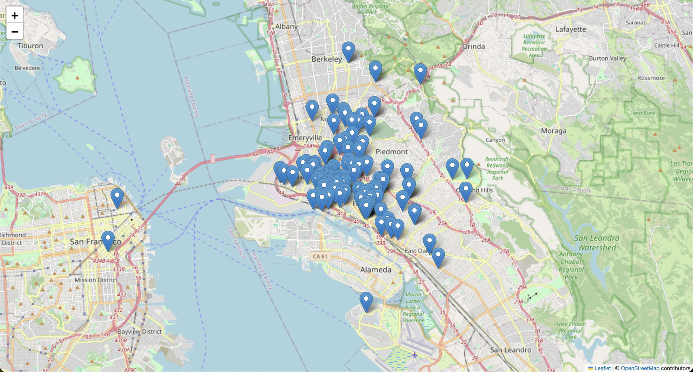

# Add points to a map (using CSV file)

<!--[](https://domlet.github.io/oakland-map-landmarks/)-->

## About

I found a list of 145 [Designated Landmarks in the City of Oakland](https://www.oaklandca.gov/topics/list-of-designated-landmarks) (California, USA), and I wanted to see how many landmarks were buildings with Black or non-white architects, since Oakland is well known historically as a "[Chocolate City](https://en.wikipedia.org/wiki/Chocolate_City_speech#:~:text=In%20African%20American%20culture%2C%20the,or%20African%20American%20political%20leadership.)".

I also wanted to see if there were any designated landmarks recognizing the Oakland birthplace of the legendary Black Panther Party, responsible for much the influential Black Power cultural and political movement of the late American Civil Rights era in the 1960s and 70s.

Because I also wanted to **see these landmarks on a map**, so I could visually analyze the geographic distribution of the _politically acknowledged_ history of The Town, I created this map. This project solves only the mapping challenge.

I asked ChatGPT for the easiest solution to "put dots on a map", and it replied this Python solution.

**Note:** In getting the solution to work, I wasted some time wrestling with multiple Python environments on my system. When finally I used a virtual environment, as ChatGPT suggested, it worked fine.

When I successfully "put dots on a map", I wrote this documentation so that I could later recall how this solution works – and also so I could direct my students (who are ~ 13 to 18 years old) to a single resource to helo them accomplish this task.

✨ _As I neared completion of this step, I realized how clearly ChatGPT writes and structures instructions, and how well it has learned from good technical documentation such as that we humans have offered to the sentient web._ ✨

## View the map

See the [live map here](https://domlet.github.io/oakland-map-landmarks/).

## Make your own map

Stop reading and just [drag a CSV file](https://support.google.com/mymaps/answer/3024836?hl=en&co=GENIE.Platform%3DDesktop) into a [Google Map](https://www.google.com/maps/d/u/0/edit?hl=en&mid=1E3UfCrVMMQ62ZC1bzePvQjvkLSGfv24&ll=37.86536700757127%2C-122.24243003173828&z=12) to "put dots on a map" instantly. (Scroll down to **Get latitude and longitude coordinates** if you need to prepare the data for your list of locations.)

### "Put dots on a map" Python with Leaflet

If you want to learn the Python workflow (which uses the [Pandas](https://www.google.com/search?q=what+is+pandas+python) and the [Folium](https://www.google.com/search?q=what+is+folium+python) library for [Leaflet](https://leafletjs.com/) 🇺🇦), follow these steps:

1. Download [this repository](https://github.com/domlet/points-on-a-map-csv-py) to your computer.

1. **Add your data.** Open your `data.csv` file and replace the data (below the header row) with your own values. The only two columns you actually need are `latitude` and `longitude`. Your data from the `name` column will appear in a map popup; the other columns will be ignored by default. Delete any rows that do not have values for both `latitude` and `longitude`.

1. **Generate your map.** On your command line, navigate to your version of this repository and enter this command: `python3 map.py` (Assuming you already have Python 3 installed.) When you execute the python script, it will generate a file called `youMadeThisMap.html` which contains your map on a webpage. Open that file in a web browser (like Firefox or Chrome) to see your map.

**Note:** If you experience a `ModuleNotFoundError` error, follow the steps in _Use a virtual environment_ (below) before you continue in this section.

1. **Revise your map.** If you want make changes to your map (such as moving or adding markers), follow these steps: (1) revise your data in your CSV file and save it; (2) delete your `youMadeThisMap.html` file; (3) run the Python script again on your command line; (4) refresh your browser or open the new HTML file to see your updated map.

1. You can [watch this video](youtube.com) to see how the process described above works.

### Use a virtual environment

If you experience a `ModuleNotFoundError` error when you run the `python3 map.py` command, it means that your computer is confused about where to find the libraries that you reference in the first lines of your python script – so nothing will work until that is fixed.

Rather than fix that complicated issue in the guts of your computer (your system configuration), you can create a virtual environment and install those libraries **exactly** where your computer is looking for them in this specific project. This is a workaround that uses more time, space, and energy – but it is a common and useful practice.

Follow the instructions below. Watch a video here.

1. **Create a virtual environment:**

   ```
   python3.12 -m venv myenv
   ```

1. **Activate your virtual environment:**

   ```
   source myenv/bin/activate
   ```

1. **Prepare to use the [`pip`](https://www.w3schools.com/python/python_pip.asp) package manager in your virtual environment:**

   ```
   python -m pip install --upgrade pip
   ```

1. **Install your libraries:**

   ```
   pip install pandas folium
   ```

1. **Run the python file:**

   ```
   python3 make-map.py
   ```

You can [watch this video](youtube.com) to see the process ↑ described above should work.

## Get latitude and longitude coordinates

When you convert between different formats for describing a location (such as lat/lng coordinates, street addresses, or place names) it is known as geocoding. When you map a collection of locations as "points on a map" you are geocoding from a text (or "string") data type into a number (or "float") data type. Learn more about [latitude and longitude from NASA](https://pwg.gsfc.nasa.gov/stargaze/Slatlong.htm).

### Single locations

1. Find a location in [Google Maps](https://google.com/maps).
2. Right-click on the specific place.
3. Click the coordinates (in the context menu) to copy them.


### Batch locations

It would be a violation of the terms of service to use this [Geocoding API](https://docs.mapbox.com/api/search/geocoding/) to convert street address data like `2025 Broadway, Oakland, California` into latitude and longitude values like `37.809856, -122.268596`, so don't use any [solution that does that](https://github.com/domlet/alumni-map/blob/main/geo.html).

## Level up to a map-based application

Sometimes we just want to "put dots on a map" and it's good to use a simple solution like the ones shown here...but if you want to **create an interactive map** that does fancy things like animations or automatic updates, you probably want to use [Mapbox](https://mapbox.com).

To see an example map app, check out the [CCPA Alumni Map](https://github.com/domlet/alumni-map/) that I created with JavaScript and MapboxGL. It automatically adds a new map marker when a user completes a Google Form to add a new row to a Google Sheet.
